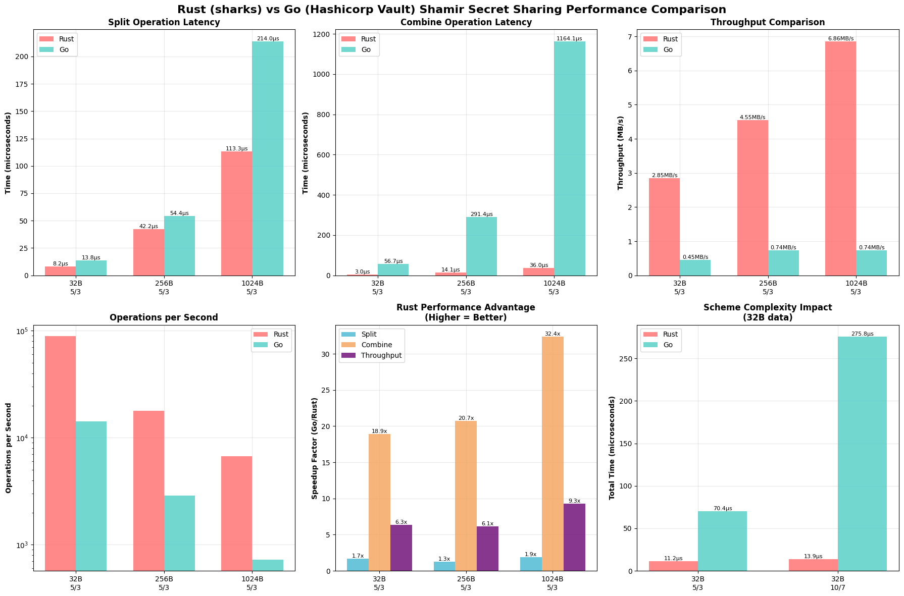

```
====================================================================================================
SHAMIR SECRET SHARING PERFORMANCE SUMMARY
====================================================================================================

KEY OBSERVATIONS:
--------------------------------------------------
1. Rust is 1.6x faster for split operations
2. Rust is 24.0x faster for combine operations
3. Rust achieves 7.3x higher throughput
4. Rust processes 7.2x more operations per second

DETAILED COMPARISON TABLE:
------------------------------------------------------------------------------------------
Scenario     Metric       Rust         Go           Improvement  Notes               
------------------------------------------------------------------------------------------
32B 5/3      Split        8.2     µs 13.8    µs 1.7     x Rust faster         
32B 5/3      Combine      3.0     µs 56.7    µs 18.9    x Rust faster         
32B 5/3      Ops/sec      89159    14197    6.3     x Rust faster         
------------------------------------------------------------------------------------------
256B 5/3     Split        42.2    µs 54.4    µs 1.3     x Rust faster         
256B 5/3     Combine      14.1    µs 291.4   µs 20.7    x Rust faster         
256B 5/3     Ops/sec      17774    2892     6.1     x Rust faster         
------------------------------------------------------------------------------------------
1KB 5/3      Split        113.3   µs 214.0   µs 1.9     x Rust faster         
1KB 5/3      Combine      36.0    µs 1164.1  µs 32.4    x Rust faster         
1KB 5/3      Ops/sec      6700     726      9.2     x Rust faster         
------------------------------------------------------------------------------------------
32B 10/7     Split        9.4     µs 29.3    µs 3.1     x Rust faster         
32B 10/7     Combine      4.4     µs 246.4   µs 56.0    x Rust faster         
32B 10/7     Ops/sec      72198    3626     19.9    x Rust faster         
------------------------------------------------------------------------------------------
```